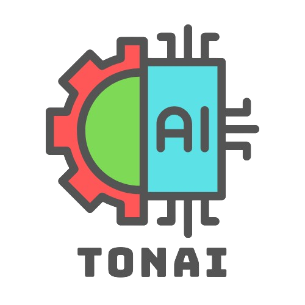
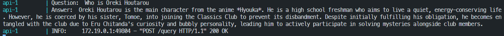

# TonAI RAG

**A simple Anime QA Chatbot powered by DeepSeek-R1 and Ollama**

<p align="center">
   
   
</p>


## Overview
A minimal RAG application to answer anime related questions.

Tech stack: 
* Local LLM with [Ollama](https://github.com/ollama/ollama).
* Hybrid search with BM25 and [FAISS](https://github.com/.facebookresearch/faiss).
* Huggingface's [text-embedding-inference](https://github.com/huggingface/text-embeddings-inference) for text embeddings and reranker.
* FastAPI as API interface.
* Docker and Docker Compose for containerization.
* Terraform to setup infrastructure



## Dataset
```bash
mkdir data/

curl -L -o ./data/myanimelist-dataset.zip https://www.kaggle.com/api/v1/datasets/download/svanoo/myanimelist-dataset

```

## Running the app 

### Preparation
We use  uv for dependency management:

```bash
pip install uv
```

Install the app dependencies:

```bash
uv pip install -r pyproject.toml
```

### Create embeddings for sementic search
First, run the server for embedding inference:
```bash
docker compose up vectorizer
```

Then run the [`ingest.py`](rag/ingest.py) script:
```bash
cd rag/

python ingest.py
```

### Running the app with docker-compose
```bash
docker compose up --build
```

### Using the application
```bash
curl -X 'POST' \
  'http://localhost:8000/query' \
  -H 'accept: application/json' \
  -H 'Content-Type: application/json' \
  -d '{
  "query": "Tell me about Hyouka"
}'
```
